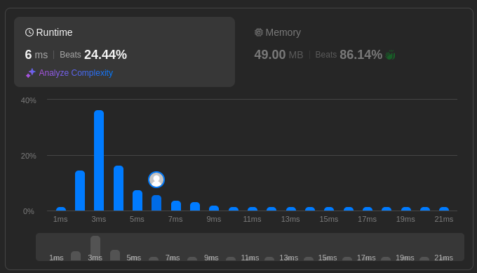
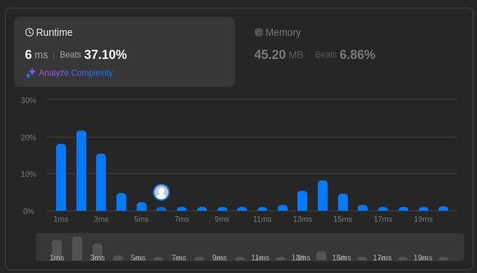
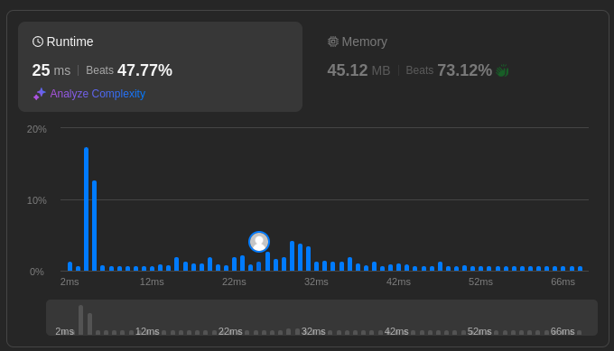
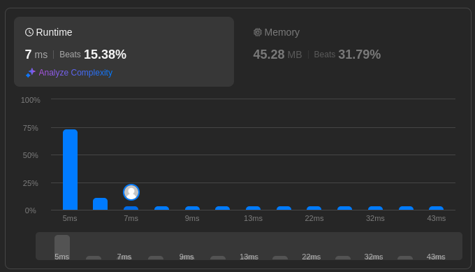

## 122. Best time to buy and sell stocks II
https://leetcode.com/problems/best-time-to-buy-and-sell-stock-ii/description/

You are given an integer array prices where prices[i] is the price of a given stock on the ith day.

On each day, you may decide to buy and/or sell the stock. You can only hold at most one share of the stock at any time. However, you can buy it then immediately sell it on the same day.

Find and return the maximum profit you can achieve.

```java
public class MaxProfit {
    public int getMaxProfit(int[] prices) {

        int profit = 0;

        if (prices.length < 2) {
            // edge case, terminate immediately
            return profit;
        }

        int l = 0; // left pointer
        int r = 1; // right pointer
        while (r < prices.length) {
            if (prices[r] <= prices[l]) {
                // no profit, move left pointer
                l = r;
            } else if (r < prices.length - 1 && prices[r+1] <= prices[r]) {
                // sell before loss
                profit += (prices[r] - prices[l]);
                l = r;
            } else if (r == prices.length - 1 && prices[r-1] <= prices[r]) {
                // final day
                profit += (prices[r] - prices[l]);
                l = r;
            }
            r += 1;
        }
        return profit;
    }

    public static void main(String[] args) {
        int[] array = {7,1,5,3,6,4};
        MaxProfit maxProfit = new MaxProfit();
        System.out.println(MaxProfit.getMaxProfit(array));
    }
}
```


## 200. Number of islands
https://leetcode.com/problems/number-of-islands/description/

Given an m x n 2D binary grid grid which represents a map of '1's (land) and '0's (water), return the number of islands.

An island is surrounded by water and is formed by connecting adjacent lands horizontally or vertically. You may assume all four edges of the grid are all surrounded by water.
```java
public class NumIslands {
    // tuple class for x, y coordinates
    static class Pair {
        int x;
        int y;
        public Pair(int x, int y) {
            this.x = x;
            this.y = y;
        }
    }

    public static void bfs(int r, int c, int[][] visited, char[][] grid) {
        Deque<Pair> q = new ArrayDeque<>(); // queue
        q.add(new Pair(r, c));
        visited[r][c] = 1;
        // 4 cardinal directions to search BFS
        int[][] directions = {{0,1}, {1,0}, {-1,0}, {0,-1}};

        while (!q.isEmpty()) {
            int row = q.peek().x;
            int col = q.peek().y;
            q.remove();
            for (int[] direction : directions) {
                int newRow = row + direction[0];
                int newCol = col + direction[1];
                // check cell is within bounds
                if (newRow >= 0 && newRow < grid.length && newCol >= 0 && newCol < grid[0].length
                        && grid[newRow][newCol] == '1' // check cell is part of an island
                        && visited[newRow][newCol] == 0) { // check cell has not been visited
                    q.add(new Pair(newRow, newCol));
                    visited[newRow][newCol] = 1;
                }
            }
        }
    }

    public int getNumIslands(char[][] grid) {
        int islands = 0;
        int[][] visited = new int[grid.length][grid[0].length];
        for (int i = 0; i < grid.length; i++) {
            for (int j = 0; j < grid[0].length; j++) {
                if (grid[i][j] == '1' && visited[i][j] == 0) {
                    islands ++;
                    bfs(i, j, visited, grid);
                }
            }
        }
        return islands;
    }

    public static void main(String[] args) {
        char[][] array = {{'1','1','0'}, {'1','1','0'}, {'0','0','1'}};
        NumIslands numIslands = new NumIslands();
        System.out.println(numIslands.getNumIslands(array));
    }
}
```


## 36. Valid Sudoku
https://leetcode.com/problems/valid-sudoku/description/

Determine if a 9 x 9 Sudoku board is valid. Only the filled cells need to be validated according to the following rules:

Each row must contain the digits 1-9 without repetition.
Each column must contain the digits 1-9 without repetition.
Each of the nine 3 x 3 sub-boxes of the grid must contain the digits 1-9 without repetition.

Note:
- A Sudoku board (partially filled) could be valid but is not necessarily solvable.
- Only the filled cells need to be validated according to the mentioned rules.
```java
public class ValidSudoku {
    public boolean isValidSudoku(char[][] board) {
        HashMap<Integer, HashSet<Character>> row = new HashMap<>();
        HashMap<Integer, HashSet<Character>> col = new HashMap<>();
        HashMap<String, HashSet<Character>> square = new HashMap<>();

        for (int i = 0; i < 9; i++) {
            for (int j = 0; j < 9; j++) {
                if (board[i][j] == '.') {
                    continue;
                }
                // check for eligible number
                if (Character.getNumericValue(board[i][j]) < 1 || Character.getNumericValue(board[i][j]) > 9) {
                    return false;
                }
                // create the pair to identify which square the number is in
                // 9 possible squares -> (0,0), (0,1), (0,2), (1,0), ..., (2,2)
                int[] pair = {Math.floorDiv(i, 3), Math.floorDiv(j, 3)};
                String strPair = Arrays.toString(pair); // String is immutable, serve as the Key
                if ( (row.containsKey(i) && row.get(i).contains(board[i][j])) ||
                        (col.containsKey(j) && col.get(j).contains(board[i][j])) ||
                        (square.containsKey(strPair) && square.get(strPair).contains((board[i][j])))
                ) {
                    return false;
                }

                if (!row.containsKey(i)) {
                    row.put(i, new HashSet<>());
                }
                row.get(i).add(board[i][j]);
                if (!col.containsKey(j)) {
                    col.put(j, new HashSet<>());
                }
                col.get(j).add(board[i][j]);
                if (!square.containsKey(strPair)) {
                    square.put(strPair, new HashSet<>());
                }
                square.get(strPair).add(board[i][j]);
            }
        }
        // when the loop finish executing without any number conflicts, it is a valid sudoku
        return true;
    }
}
```


## 1615. Maximal Network Rank
https://leetcode.com/problems/maximal-network-rank/description/

There is an infrastructure of n cities with some number of roads connecting these cities. Each roads[i] = [ai, bi] indicates that there is a bidirectional road between cities ai and bi.

The network rank of two different cities is defined as the total number of directly connected roads to either city. If a road is directly connected to both cities, it is only counted once.

The maximal network rank of the infrastructure is the maximum network rank of all pairs of different cities.

Given the integer n and the array roads, return the maximal network rank of the entire infrastructure.
```java
public class MaximalNetworkRank {
    public int getMaximalNetworkRank(int n, int[][] roads) {
        HashMap<Integer, HashSet<Integer>> networks = new HashMap<>();
        for (int i = 0; i < n; i ++) {
            networks.put(i, new HashSet<>());
        }
        // populate the hashsets in networks hashmap
        for (int[] road : roads) {
            networks.get(road[0]).add(road[1]);
            networks.get(road[1]).add(road[0]);
        }
        // calculate the max network rank
        int maxRank = 0;
        for (int i = 0; i < n-1; i ++) {
            for (int j = i+1; j < n; j ++) {
                int tmp = 0;
                tmp += (networks.get(i).size() + networks.get(j).size());
                // if road is connected between cities, avoid double counting
                if (networks.get(i).contains(j)) {
                    tmp --;
                }
                maxRank = Math.max(maxRank, tmp);
            }
        }
        return maxRank;
    }

    public static void main(String[] args) {
        int[][] array = {{0,1}, {0,3}, {1,2}, {1,3}};
        MaximalNetworkRank maximalNetworkRank = new MaximalNetworkRank();
        System.out.println(maximalNetworkRank.getMaximalNetworkRank(array.length, array));
    }
}
```


## 2730. Find the longest semi repetitive substring
https://leetcode.com/problems/find-the-longest-semi-repetitive-substring/description/
You are given a digit string s that consists of digits from 0 to 9.

A string is called semi-repetitive if there is at most one adjacent pair of the same digit. For example, "0010", "002020", "0123", "2002", and "54944" are semi-repetitive while the following are not: "00101022" (adjacent same digit pairs are 00 and 22), and "1101234883" (adjacent same digit pairs are 11 and 88).

Return the length of the longest semi-repetitive substring of s.

```java
public class LongestSemiRepetitiveSubstring {
    public int getLongestSemiRepetitiveSubstring(String s) {
        int start = 0;
        int maxLength = 0;
        int prevRepeatedI = 0; // index of previous repeated
        int prevChar = s.charAt(0); // previous last seen char

        List<Character> listOfCharacters = new ArrayList<>();
        for (char ch : s.toCharArray()) {
            listOfCharacters.add(ch);
        }

        ListIterator<Character> iterator = listOfCharacters.listIterator();
        while (iterator.hasNext()) {
            int i = iterator.nextIndex();
            int currChar = iterator.next();
            if (prevChar == currChar) {
                if (prevRepeatedI != 0) {
                    // more than one pair of same digits
                    start = prevRepeatedI;
                }
                prevRepeatedI = i;
            }
            maxLength = Math.max(i - start + 1, maxLength);
            prevChar = currChar;
        }
        return maxLength;
    }

    public static void main(String[] args) {
        String s = "52233";
        LongestSemiRepetitiveSubstring longestSemiRepetitiveSubstring = new LongestSemiRepetitiveSubstring();
        System.out.println(longestSemiRepetitiveSubstring.getLongestSemiRepetitiveSubstring(s));
    }
}
```
